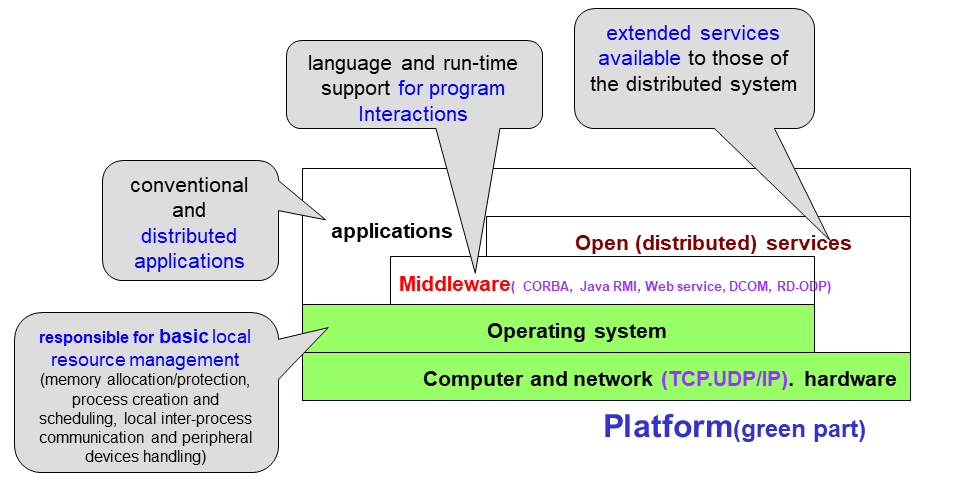

# System Models

## Architecture 

### Architectural Styles

- Layered architectural style

  

- Object-based architectural style

  

- Event-based architectural style

  

- Shared data-space architectural style

  

### Application Layering

- User-interface level
- Processing level
- Data level

### Multitiered Architectures

- Example of a server acting as client:

  

### Peer-to-Peer Architectures

### Client-Sever System

- Client: Process that request a service
- Server: Process that provides a service
- Client blocks until server responds
- Client is invoked by end users when they require a service
- Server waits for incoming requests
- Server can have many clients making concurrent requests
- Server is a program with special system privileges

#### Gartner Group Configuration

2-tier Architectures

2-tier Database System's Architecture 

- user interface = presentation
- application = logic
- database = data

3-tier Architectures

## Software Layers

- Service layers
- Higher-level access services at lower layers
- Services can be located on different computers
- Process types:
  - Server process
  - Client process
  - Peer processes (client process + server process)

### Important Layers
- Platform
  - Lowest-level hardware + software(OS + Communication)
  - Common programming interface
  - Different implementations of operating system facilities for co-ordination & communication

- Middleware
  - programming support for distributed computing

### Software Concepts

- DOS (Distributed Operating Systems)
- NOS (Network Operating Systems)
- Middleware

### Structures

- Network Operating System

  

- Distributed Operating Systems

  

- Distributed System as Middleware

  

### Middleware

Middleware is computer software that provides services to software applications beyond those available from the operating system.

Provides...

- Support for distributed processes/objects:
  - Suitable for applications programming
  - Communication via the following mechanisms
    - Remote method invocation (Java RMI), or
    - Remote procedure call (Sun RPC)
- Services infrastructure for application programs
  - Naming, security, transactions, event notification, ...
  - Commercial products: CORBA, DCOM,…

In an open middleware-based distributed system, the protocols used by each middleware layer should be the same, as well as the interfaces they offer to applications.

## Architecture models

- Client-Server Model

- Multiple Server Model

  Improve performance and reliability

  

- Proxy Server Model and Caching Mechanism

  - Reduce load on network

  - Provide access through firewall

  

- Peer Process Model

  For faster interactive response 

  

- Horizontal Distribution

  

- Web applets

  

### Thin & Fat Clients

- Thin client = Network computer

  

  - Typically no local storage
  - Has only presentation function (= user interface) 

- Fat Client = Desktop PC, Workstation

  

  - Has both presentation function and logic function (= application) 

## Design Requirements

1. Performance

   1. Responsiveness

      1. Fast interactive response delayed by remote requests

      2. Use of caching, replication

         

         - Browsers and proxies can validate a cached response
           If fails, web server returns a fresh response instead of stale response
         - Browsers and proxies stores expiry time of cached resource and server time with cached responses

   2. Throughput

      - Dependent on speed of server and data transfer

   3. Load balancing

      - Use of applets, multiple servers

2. Quality of Service (QoS)

   1. Deadline properties

      1. Hard deadlines 

      2. Soft deadlines 

         - Multimedia traffic, video/sound synchronization

         - Depend on availability of sufficient resources

   2. Adaptability

      Ability to adapt to changing system configuration

3. Dependability

   1. Correctness

      Ensuring correctness of  distributed and concurrent programs
      e.g. use of verification

   2. Fault-tolerance

      Ability to tolerate/recover from faults
      e.g. use of redundancy

   3. Security

      Ability to withstand malicious attack
      e.g. use of encryption, etc.

### Fundamental Models  
- Interaction Model

  - Distributed systems have many processes, complex interactions among them

    Transmission of message between processes (local, remote)

  - Interacting processing

    - Communication performance
    - Impossible to maintain global time (each system has its local time)

  - Performance of communication channel

    - Latency (message, network, system)
    - Bandwidth
    - Jitter

  - Computer clocks and timing events

    - Clock drift rate (global time needed)
    - Clock synchronization

  - Two variants of the interaction model

    - Synchronous DS has on:
      - Process is executing in a known lower/upper bounded time
      - Message is received within a known bounded time
      - Known local clock's drift rate
    - Asynchronous DS has no bounds on:
      - Process execution speed
      - Message transmission delay
      - Clock drift rate

- Failure Model

  - Omission failures

    - Process omission failures

      Correct, fail-stop, timeouts

    - Communication failures

      Send/receive omission failures

    

  - Arbitrary failures (= Byzantine failure, Data failure)

    Process/channel exhibits arbitrary behavior (delivering corrupted, non-existed message)

  - Timing Failures

    

  - The others:

    - Masking failures

      Checksum failure

    - Failure of reliability of one-to-one communication

      Threats of validity and integrity

- Security Model

  - Protecting objects 

    

  - Securing processes and their interactions
    - Introducing a model for analysis of security threats
    - The enemy
      Threats to process and channel