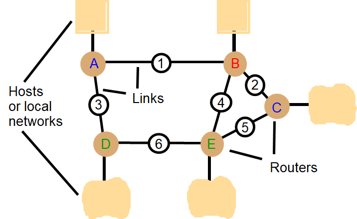

# Networking and Interworking

## Network issues

- Performance

  - Latency

  - Data transfer rate

    - Data transfer rate = amount of Data / time

    - Message transfer rate time = latency + massage length / data transfer rate 

  - Total system bandwidth of network

    - Throughput (吞吐量) in the end systems
    - Total volume of traffic can be transferred across network in a time

- Scalability
  No designable to cope with size and load about network growing 

- Reliability
  Recoverable from communication failures

- Security
  Protecting network and computers

- Mobility

  - Portability of  computer and handled digital devices using wireless network
  - Location and  identification are depicted with each other
  - No designable to cope with size and load about network growing 

- QoS (Quality of Service)

  Guarantee for requirements of computer and network
  to meet deadline, bandwidth, bounded latency

- Multicasting
  One-to-many communication

## Types of Networks

- LANs (Local Area Networks)
  Technology suitable for small area, wire/fiber

  - High bandwidth 
  - Low latency
  - ATM, better QoS, but more expensive

- WANs (Wide Area Networks)
  Large distances, inter-city/country/continental

  - Low bandwidth, high latency
  - Satellite/wire/cable
  - Routers introduce delays

- MANs (Metropolitan Area Networks)
  Intra-city, cable based, multimedia

- Wireless networks
  WLANs, WPANs (wireless personal area network)

  - WLANs: Wireless Local Area Networks
    to replace wired LANs

    - WaveLAN technology 

      WIFI: Wireless Internet Platform for Interoperability

      IEEE 802.11

    - WMAN: Wireless Metropolitan Area Networks

      WiMAX: Worldwide Interoperability for Microwave Access

      IEEE 802.16

  - WPANs: Wireless Personal Area Networks

    - Infrared (infra-red) links

    - Bluetooth: IEEE 802.15.1 (standard no longer maintained)

    - Mobile phone network (Wireless WAN)
      - European GSM: Global system for Mobile communication
      - US: analogue AMPS: Advanced Mobile Phone System
      Cellular radio network, Cellular digital packet data
      Replaced by GSM

    - WAP: Wireless Applications Protocol
      For use on wireless potable devices

      

## Network Principles

### Mode of Transmission

- Packets
  1. Messages divided into packets (on Transport Layer)
  2. Packets **queued in buffers** before sent onto link
  - QoS not guaranteed
- Data streaming

  - Links **guarantee QoS** (rate of delivery)
  - For multimedia traffic
  - Need higher bandwidth

### Switching Schemes

- Broadcasts (Ethernet, wireless)
  - Send messages to all nodes
  - Nodes listen for own messages (carrier sensing)
- Circuit switching (phone networks)
- Packet switching (TCP/IP)
  - Store-and-forward
  - Unpredictable delays
- Frame/Cell relay (ATM) 
  - Bandwidth & latency guaranteed (virtual path)
  - Small, fixed size packets (padded if necessary)
    53 bytes= header 5 + body 48
  - Avoids error checking at nodes (use reliable links)

### Protocols


- OSI Model

  

- Message encapsulation

  

- Internetwork protocol 

  - Internetwork layer(=Virtual network layer)
    internet packet → destination (by datagram protocol)
  - Network interfaces layer
    internetwork packets → suitable packets → underlying layer
  - Underlying network layer

  

- Port & Addressing

  - Port
    - Network-independent message transport service between networks ports
    - Software-definable destination points for communications

  - Addressing 
    - Delivering messages to destination with transport addresses
    - Transport address
      Network address + port number

- Packet delivery

  - In network layer

    - Datagram packet delivery (IP in Ethernet, most wired and wireless LAN technologies)
    - Virtual circuit packet delivery (ATM)

  - In transport layer

    - Connection-oriented transmission(TCP)
      Reliable communication with static routing table (ISO, X.25)
      Ex) remote login(Telnet), FTP, HTTP(big-sized file), stream data

    - Connectionless transmission (UDP)
      Unreliable communication with pre-defined routing table
      Ex) rcp, rwho, RPC, HTTP(small-sized file), FTP(non-error bulk file)

### Routing

- Necessary in non-broadcast networks (cf Internet) : Hop by Hop
- Distance-vector algorithm for each node
  - Stores table of state & cost information of links, cost infinity for faulty links
  - Determines route taken by packet (the next hop)
  - Periodically updates the table and sends to neighbors
  - May converge slowly [Bellman-Ford]
- RIP-1 (Router Information Protocol) for Internet
  - Local router table changes
  - Use default routes, plus multicast and authentication
  - Better convergence (routes better route to an existing destination)



- RIP routing algorithm

  Variables: ```Tl``` local table, ```Tr``` remote table received.

  *  ```Rr```: remote, ```Rl``` : local

  Send: Each `t` seconds or when `Tl` changes, send `Tl` on each non-faulty outgoing link.
  Receive: Whenever a routing table `Tr` is received on link `n`:

  ```java
  for all rows Rr in Tr {
  	if (Rr.link != n) {
  		Rr.cost = Rr.cost + 1; // hop
  		Rr.link = n;
  		if (Rr.destination is not in Tl) add Rr to Tl;
   		// add new destination to Tl
   		else for all rows Rl in Tl {
  			if (Rr.destination = Rl.destination and (Rr.cost < Rl.cost or Rl.link = n)) 
  				Rl = Rr;
  			// Rr.cost < Rl.cost : remote node has better route
   			// Rl.link = n : remote node is more authoritative
  		}
  	}
  }
  ```

- Routing tables (A -> C)

  

### Congestion Control

- When load on network exceeds 80%  of its capacity
  packet queues long, links blocked
- Solutions (in datagram-based network layers)
  - packet dropping
    reliable of delivery at higher levels
  - reduce rate of transmission
    - nodes send choke packets (Ethernet)
      special message requesting a reduction in transmission rate
    - transmission control (TCP)
  - transmit congestion information to each node
    QoS guarantees (ATM)

